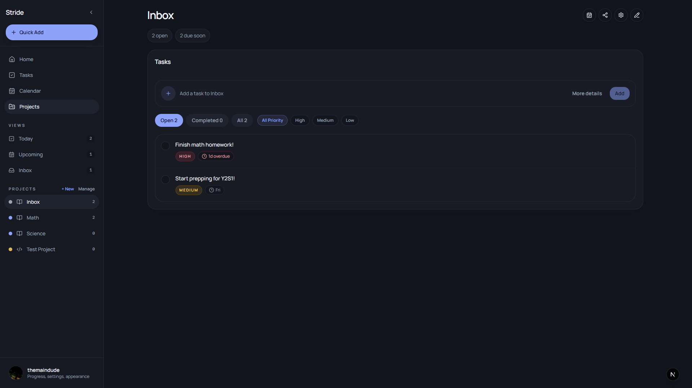
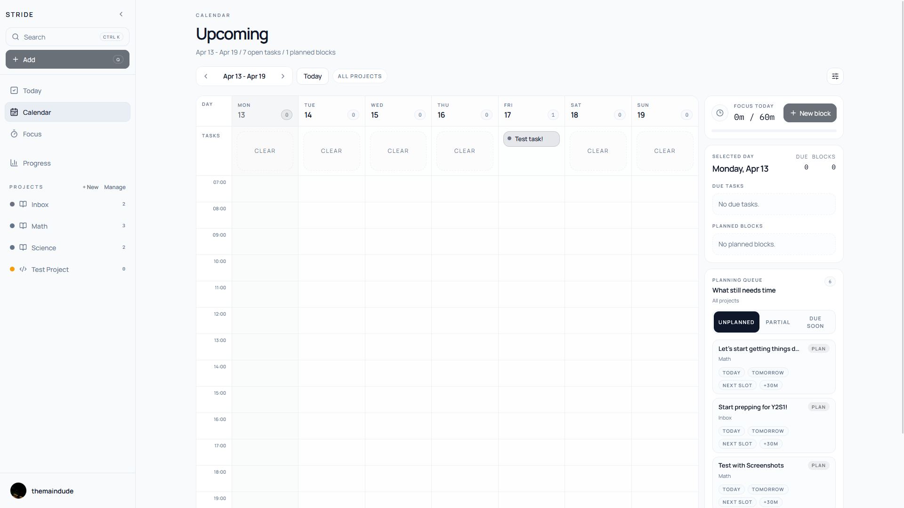
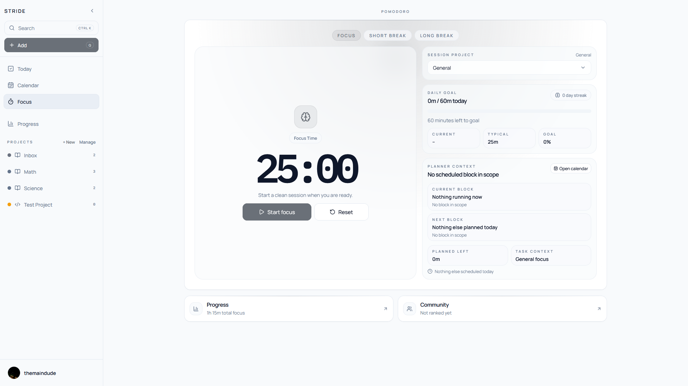
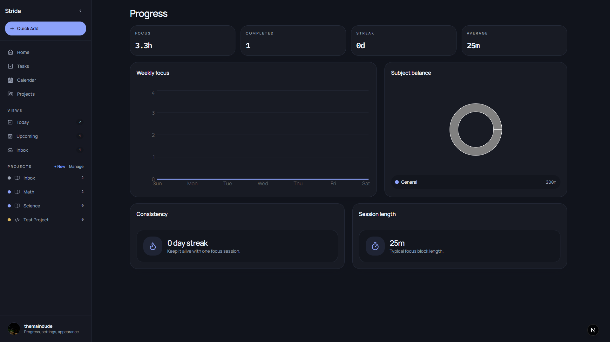
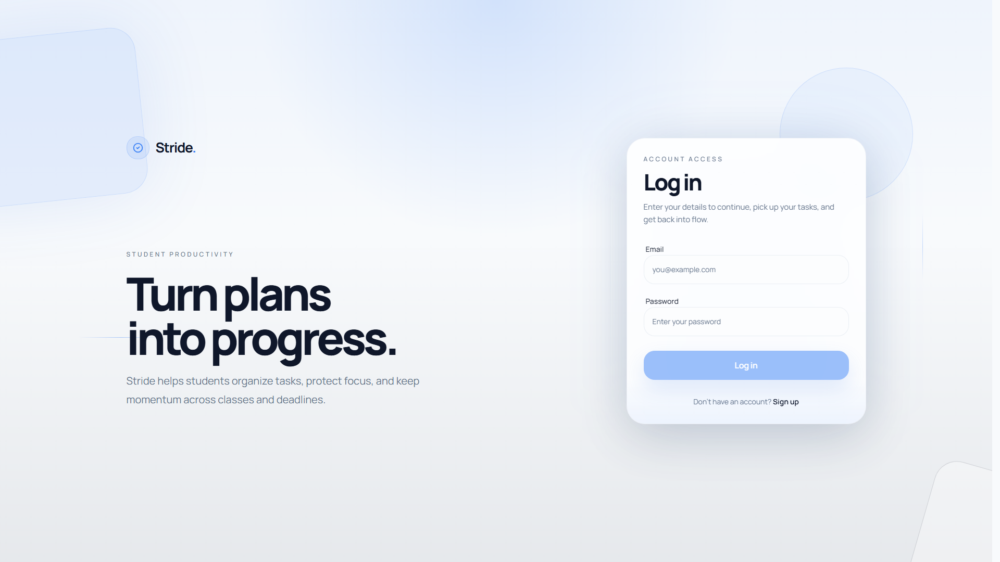

# Stride

Stride is an execution-first student productivity web app that connects tasks, planning, focus sessions, and a weekly review loop.

Live demo: https://stride.rudhresh.app

## What Stride Is

Stride is built around one loop:

1. Capture tasks quickly.
2. Clarify what matters now.
3. Plan realistic focus time.
4. Execute in focused sessions.
5. Review what happened and adjust.

## Who It Is For

Students who:

- manage multiple classes/projects and deadlines
- want one workflow that ties tasks → planned work → focus time → weekly review
- prefer a dense, keyboard-friendly workspace over a lightweight checklist

## Current Product Direction

- Execution-first workflow: tighten the end-to-end loop instead of adding disconnected features.
- Reliability and consistency: harden optimistic UI + realtime reconciliation and reduce cross-route UX drift.
- Packaging/distribution is tracked separately (PWA → wrappers) and treated as a follow-up to reliability.

## Implemented Features (Current Repo)

App surfaces (App Router routes):

- Primary: `/tasks`, `/calendar`, `/focus`, `/projects`
- Secondary: `/progress`, `/community`, `/settings`

Auth and onboarding:

- Email/password login + sign-up via Supabase Auth (`/login`)
- Server-side route gating for authenticated pages (redirects unauthenticated users to `/login`)
- Workspace bootstrap for new users (profile + Inbox provisioning)

Tasks:

- Smart views: Today, Upcoming, No Due Date, Completed
- Saved task views (filter presets)
- Quick Add parser (project, deadlines, priority, estimate, reminders, recurrence, labels)
- Rich task detail: description, labels, priority, deadlines, reminders, recurrence, estimates
- Steps (checklist), attachments, comments, assignee field (foundation)
- Bulk selection + task actions

Calendar / planning:

- Persisted planned focus blocks (can be task-linked)
- Planner filtering + saved planner filters
- Week/month planning surfaces (currently built around persisted blocks + profile preferences)

Focus:

- Dedicated focus/break timer surface
- Focus sessions persisted and attributed to task / planned block when available

Projects:

- Project (list) workspace with list + board views
- Sections with reorder + cross-section task movement
- Membership model in the database (shared lists); UI includes collaboration-aware fields (assignees/comments)

Progress / community:

- Weekly review (`/progress`) built from tasks + focus sessions + planned blocks (e.g. slips and estimate signals)
- Weekly commitments (`/community`) backed by a `weekly_commitments` table; additional community insights are still WIP

Preferences:

- Synced profile preferences (timezone, planner defaults, week start, compact mode, shell ordering/accent tokens)

## Gallery

| Tasks | Calendar | Focus |
| :---: | :---: | :---: |
|  |  |  |

| Progress | Login |
| :---: | :---: |
|  |  |

## Stack

- Next.js (App Router)
- React + TypeScript
- Tailwind CSS + shadcn/ui + Framer Motion
- Supabase: Postgres + Auth + Realtime + Storage + RLS (SQL migrations in `supabase/migrations/`)
- Observability/analytics: Sentry, Vercel Speed Insights, PostHog (optional)
- Tests: Vitest (focused on semantic utilities)

## Setup / Environment

Prereqs: Node.js + npm, a Supabase project, and (optionally) the Supabase CLI.

1) Install dependencies

```bash
npm install
```

2) Configure environment variables

Start from `.env.example`:

```bash
cp .env.example .env
```

Required:

```bash
NEXT_PUBLIC_SUPABASE_URL="https://YOUR_PROJECT_REF.supabase.co"
NEXT_PUBLIC_SUPABASE_ANON_KEY="YOUR_SUPABASE_ANON_KEY"
```

Optional (PostHog is only initialized when both are present):

```bash
NEXT_PUBLIC_POSTHOG_PROJECT_TOKEN="phc_your_project_token"
NEXT_PUBLIC_POSTHOG_HOST="https://us.i.posthog.com"
```

3) Apply database migrations

- Source of truth: `supabase/migrations/*.sql`
- Recommended: `supabase db push` (Supabase CLI), or apply the SQL in timestamp order via the Supabase SQL editor.

4) Create required Supabase Storage buckets

- `todo-images` (task attachments)
- `profile-avatars` (profile images)

5) Run locally

```bash
npm run dev
```

If your PowerShell policy blocks `npm.ps1`, use `npm.cmd run dev`.

## Current Status

Ongoing work. The core routes and database-backed workflow are implemented, but the project is still in active iteration:

- The data model continues to evolve via SQL migrations.
- Realtime + optimistic updates are used in several places and are being hardened.
- Offline-first behavior is not a product guarantee yet.

## Next Steps

Near-term priorities (see `todo.md` for the full backlog):

- Add interaction-level regression coverage for high-risk flows (planner blocks, quick add, task detail guard, focus persistence).
- Improve rollback/error handling in optimistic mutations and tighten instrumentation in failure-prone flows.
- UX consistency + mobile ergonomics pass across Tasks/Projects/Calendar.
- Deepen shell actions (beyond navigation) without inflating global state.
- Packaging track (PWA first) only after reliability milestones.
