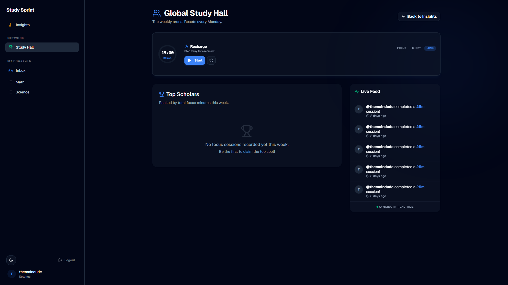

# Study Sprint
A gamified productivity platform for students.

[](https://todo-supabase-t3.vercel.app)
[](https://www.linkedin.com/in/rudhresh-r/)

## The Vision
Students often have clear to-do lists but struggle to bridge the gap between "planning" and "doing." Without session tracking, daily feedback, and accountability, studying remains irregular and stressful.

**Study Sprint** solves this by merging advanced task management with Pomodoro-style focus sprints and social gamification. It turns the solitary grind of studying into a measurable, shared experience.

## Core Features

### 🎯 Deep Focus & Analytics
- **Sprint Mode:** A dedicated Pomodoro timer that synchronizes focus blocks directly to your database, allowing you to track and analyze your study habits over time.
- **Insights Dashboard:** Real-time visualization of your progress through interactive charts, session history, and study streak tracking.
- **Global Study Hall:** A weekly leaderboard to rank focus time among peers, featuring a live activity feed so you never study alone.

### ✅ Modern Task Management
- **Fluid Interaction Model:** Minimalist design that uses inline expansion for task details, eliminating heavy modal dialogs for a fluid UX.
- **Intelligent Filtering:** Instantly pivot your view by status (All/Active/Done) or priority (High/Medium/Low) pill-shaped toggles.
- **Real-time Collaboration:** Share and edit project lists with peers with instant device synchronization via Supabase Realtime.

### 🚀 Technical Foundation
- **Optimized Performance:** Leverages parallel fetching, a global state provider, and fully optimistic UI updates for a responsive experience.
- **Robust Security:** Every table is protected by granular Row Level Security (RLS) policies, ensuring users only access what they own or were invited to.
- **Modern Stack:** Built with Next.js 14, TypeScript, Tailwind CSS, and shadcn/ui.

---

## 🖼️ Visual Gallery

| Authentication | Insights Dashboard |
| :---: | :---: |
|  |  |

| Global Study Hall | Task Management |
| :---: | :---: |
|  |  |

---

## Tech Stack
- **Frontend:** Next.js 14, React, TypeScript, Tailwind CSS, Recharts
- **Backend/BaaS:** Supabase (PostgreSQL, Auth, RLS, Realtime, Storage)

---

## Getting Started

### 1) Environment Variables
Create a file named **`.env.local`** in the project root:

```bash
NEXT_PUBLIC_SUPABASE_URL="https://YOUR_PROJECT_REF.supabase.co"
NEXT_PUBLIC_SUPABASE_ANON_KEY="YOUR_SUPABASE_ANON_KEY"
```

> [!IMPORTANT]
> **Security:** Add `.env.local` to your `.gitignore` file and never commit it to GitHub.

### 2) Supabase Setup
Run the following SQL blocks in your Supabase **SQL Editor**.

#### A. Tables & Relations
```sql
-- PROFILES
create table if not exists public.profiles (
  id uuid primary key references auth.users(id) on delete cascade,
  username text unique,
  full_name text,
  avatar_url text,
  updated_at timestamptz default now()
);

-- LISTS
create table if not exists public.todo_lists (
  id uuid primary key default gen_random_uuid(),
  owner_id uuid not null references auth.users(id) on delete cascade,
  name text not null,
  inserted_at timestamptz default now()
);

-- MEMBERSHIP
create table if not exists public.todo_list_members (
  list_id uuid not null references public.todo_lists(id) on delete cascade,
  user_id uuid not null references auth.users(id) on delete cascade,
  role text not null default 'editor',
  inserted_at timestamptz default now(),
  primary key (list_id, user_id),
  constraint todo_list_members_role_valid check (role in ('owner','editor','viewer'))
);

-- TODOS
create table if not exists public.todos (
  id uuid primary key default gen_random_uuid(),
  user_id uuid not null references auth.users(id) on delete cascade,
  list_id uuid references public.todo_lists(id) on delete cascade,
  title text not null,
  description text,
  due_date timestamptz,
  priority text, -- 'high', 'medium', 'low'
  is_done boolean not null default false,
  inserted_at timestamptz default now(),
  updated_at timestamptz default now()
);

-- FOCUS SESSIONS
create table if not exists public.focus_sessions (
  id uuid primary key default gen_random_uuid(),
  user_id uuid not null references auth.users(id) on delete cascade,
  list_id uuid references public.todo_lists(id) on delete cascade,
  duration_seconds int not null,
  mode text not null, -- 'focus', 'shortBreak', 'longBreak'
  inserted_at timestamptz default now()
);

-- IMAGES
create table if not exists public.todo_images (
  id uuid primary key default gen_random_uuid(),
  todo_id uuid not null references public.todos(id) on delete cascade,
  user_id uuid not null references auth.users(id) on delete cascade,
  list_id uuid references public.todo_lists(id) on delete cascade,
  path text not null,
  inserted_at timestamptz default now()
);

-- WEEKLY LEADERBOARD VIEW
create or replace view public.weekly_leaderboard as
  select 
    p.id as user_id,
    p.username,
    p.avatar_url,
    coalesce(sum(fs.duration_seconds), 0) / 60 as total_minutes
  from public.profiles p
  left join public.focus_sessions fs on fs.user_id = p.id
    and fs.mode = 'focus'
    and fs.inserted_at >= date_trunc('week', now())
  group by p.id, p.username, p.avatar_url;
```

#### B. Row Level Security & Helpers
```sql
-- Enable RLS
alter table public.profiles enable row level security;
alter table public.todos enable row level security;
alter table public.todo_images enable row level security;
alter table public.todo_lists enable row level security;
alter table public.todo_list_members enable row level security;
alter table public.focus_sessions enable row level security;

-- Granular access control
create or replace function public.is_list_owner(lid uuid) returns boolean 
language sql security definer set search_path = public as $$
  select exists (select 1 from public.todo_lists where id = lid and owner_id = auth.uid());
$$;

create or replace function public.is_list_member(lid uuid) returns boolean
language sql security definer set search_path = public as $$
  select exists (select 1 from public.todo_list_members where list_id = lid and user_id = auth.uid());
$$;

create or replace function public.can_edit_list(lid uuid) returns boolean
language sql security definer set search_path = public as $$
  select exists (select 1 from public.todo_list_members where list_id = lid and user_id = auth.uid() and role in ('owner','editor'));
$$;

-- Policies
create policy "Anyone can view profiles" on public.profiles for select using (true);
create policy "Users can update their own profile" on public.profiles for update using (auth.uid() = id);

create policy "Members can view lists" on public.todo_lists for select using (public.is_list_member(id));
create policy "Authenticated users can create lists" on public.todo_lists for insert with check (auth.uid() = owner_id);
create policy "Owners can update lists" on public.todo_lists for update using (public.is_list_owner(id));
create policy "Owners can delete lists" on public.todo_lists for delete using (public.is_list_owner(id));

create policy "Members can view list members" on public.todo_list_members for select using (public.is_list_member(list_id));
create policy "Owners can manage list members" on public.todo_list_members for all using (public.is_list_owner(list_id));

create policy "Users can view todos in their lists" on public.todos for select using (public.is_list_member(list_id));
create policy "Editors can insert todos" on public.todos for insert with check (public.can_edit_list(list_id));
create policy "Editors can update todos" on public.todos for update using (public.can_edit_list(list_id));
create policy "Editors can delete todos" on public.todos for delete using (public.can_edit_list(list_id));

create policy "Users can view their own focus sessions" on public.focus_sessions for select using (auth.uid() = user_id);
create policy "Users can insert their own focus sessions" on public.focus_sessions for insert with check (auth.uid() = user_id);

create policy "Users can view images in their lists" on public.todo_images for select using (public.is_list_member(list_id));
create policy "Editors can insert images" on public.todo_images for insert with check (public.can_edit_list(list_id));
create policy "Editors can delete images" on public.todo_images for delete using (public.can_edit_list(list_id));
```

#### C. Realtime Enablement
```sql
alter publication supabase_realtime set (publish = 'insert, update, delete');
alter publication supabase_realtime add table public.todos, public.todo_images, public.focus_sessions;

alter table public.todos replica identity full;
alter table public.todo_images replica identity full;
alter table public.focus_sessions replica identity full;
```

### 3) Storage Bucket
1. Create a **Public** bucket named `todo-images` in the Supabase Dashboard.
2. Under the **Policies** tab for the bucket, add RLS policies for:
   - **Select:** `(select exists (select 1 from public.todos where id = (storage.foldername(name))[2]::uuid and public.is_list_member(list_id)))`
   - **Insert/Delete:** `(select exists (select 1 from public.todos where id = (storage.foldername(name))[2]::uuid and public.can_edit_list(list_id)))`

---

## Roadmap (Actively Maintained)
- **[Planned] Planning Hub:** Calendar and weekly overview.
- **[Completed] Global Study Hall:** Real-time social leaderboard.
