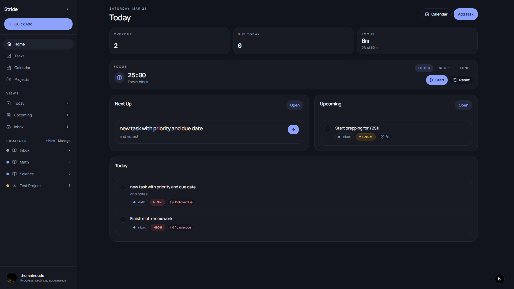

# Stride

Stride helps students turn plans into progress.

[](https://todo-supabase-t3.vercel.app)
[](https://www.linkedin.com/in/rudhresh-r/)

## The Vision

Students usually do not struggle with writing tasks down. They struggle with turning plans into consistent execution.

Stride is built around that gap. It combines task management, calendar planning, focus sessions, and lightweight accountability into a single student productivity workflow that is designed to help captured work become scheduled, focused, and finished.

Stride is an execution-first academic planner built on Next.js and Supabase. The current product combines smart task views, project workspaces, a weekly planner, focus sessions, lightweight community progress, and a premium task-first shell.

## Current Product Shape

### Primary routes

- `/home`
- `/tasks`
- `/calendar`
- `/projects`

### Secondary routes

- `/progress`
- `/community`
- `/settings`

### Legacy redirects

- `/dashboard` -> `/home`
- `/todos` -> `/tasks`
- `/planning` -> `/calendar`
- `/study-hall` -> `/community`

## Current UX Model

- Collapsible desktop sidebar with smart views, projects, quick add, and account utilities
- Mobile drawer navigation instead of a bottom tab bar
- Smart task views for `Today`, `Upcoming`, `Inbox`, and user-facing `Completed`
- Inline task capture on main task surfaces plus shell-level quick add
- Row-click task opening with a centered desktop modal and mobile full-height task sheet
- Project workspaces with inline add, priority filtering, member management, and project settings
- Calendar planning with persisted `planned_focus_blocks`
- Focus sessions tied to daily goal tracking and community progress

## Core Features

- Smart task views driven by deterministic rules
- Deterministic `Next Up` recommendation
- Task priority, due dates, notes, estimates, attachments, and completion metadata
- Project icons, color tokens, members, and per-project workspaces
- Planned focus blocks linked to tasks or standalone project work
- Focus timer with persisted sessions
- Community leaderboard powered by `weekly_leaderboard`
- Theme system with `light`, `dark`, and `midnight`

## Visual Gallery

| Authentication | Home |
| :---: | :---: |
|  |  |

| Tasks | Calendar |
| :---: | :---: |
|  |  |

## Stack

- Next.js 16 App Router
- React + TypeScript
- Tailwind CSS + shadcn/ui + Framer Motion
- Supabase Postgres + Auth + Realtime + Storage + RLS

## Local Setup

### 1. Install dependencies

```bash
npm install
```

### 2. Configure environment variables

Create `.env.local`:

```bash
NEXT_PUBLIC_SUPABASE_URL="https://YOUR_PROJECT_REF.supabase.co"
NEXT_PUBLIC_SUPABASE_ANON_KEY="YOUR_SUPABASE_ANON_KEY"
```

### 3. Set up Supabase

This repo relies on a core schema plus the checked-in migration files.

#### 3A. Core schema

Run this once in the Supabase SQL editor if your project is empty.

```sql
create table if not exists public.profiles (
  id uuid primary key references auth.users(id) on delete cascade,
  username text unique,
  full_name text,
  avatar_url text,
  daily_focus_goal_minutes integer not null default 120,
  updated_at timestamptz default now(),
  constraint profiles_daily_focus_goal_minutes_positive
    check (daily_focus_goal_minutes > 0)
);

create table if not exists public.todo_lists (
  id uuid primary key default gen_random_uuid(),
  owner_id uuid not null references auth.users(id) on delete cascade,
  name text not null,
  color_token text not null default 'cobalt',
  icon_token text not null default 'book-open',
  inserted_at timestamptz default now()
);

create table if not exists public.todo_list_members (
  list_id uuid not null references public.todo_lists(id) on delete cascade,
  user_id uuid not null references auth.users(id) on delete cascade,
  role text not null default 'editor',
  inserted_at timestamptz default now(),
  primary key (list_id, user_id),
  constraint todo_list_members_role_valid
    check (role in ('owner', 'editor', 'viewer'))
);

create table if not exists public.todos (
  id uuid primary key default gen_random_uuid(),
  user_id uuid not null references auth.users(id) on delete cascade,
  list_id uuid not null references public.todo_lists(id) on delete cascade,
  title text not null,
  description text,
  due_date timestamptz,
  priority text,
  is_done boolean not null default false,
  estimated_minutes integer,
  completed_at timestamptz,
  inserted_at timestamptz not null default now(),
  updated_at timestamptz not null default now(),
  constraint todos_priority_valid
    check (priority in ('high', 'medium', 'low') or priority is null),
  constraint todos_estimated_minutes_positive
    check (estimated_minutes is null or estimated_minutes > 0)
);

create table if not exists public.focus_sessions (
  id uuid primary key default gen_random_uuid(),
  user_id uuid not null references auth.users(id) on delete cascade,
  list_id uuid references public.todo_lists(id) on delete set null,
  duration_seconds integer not null,
  mode text not null,
  inserted_at timestamptz not null default now(),
  constraint focus_sessions_mode_valid
    check (mode in ('focus', 'shortBreak', 'longBreak'))
);

create table if not exists public.todo_images (
  id uuid primary key default gen_random_uuid(),
  todo_id uuid not null references public.todos(id) on delete cascade,
  user_id uuid not null references auth.users(id) on delete cascade,
  list_id uuid not null references public.todo_lists(id) on delete cascade,
  path text not null,
  inserted_at timestamptz not null default now()
);

create table if not exists public.planned_focus_blocks (
  id uuid primary key default gen_random_uuid(),
  user_id uuid not null references auth.users(id) on delete cascade,
  list_id uuid not null references public.todo_lists(id) on delete cascade,
  todo_id uuid references public.todos(id) on delete set null,
  title text not null,
  scheduled_start timestamptz not null,
  scheduled_end timestamptz not null,
  inserted_at timestamptz not null default now(),
  updated_at timestamptz not null default now(),
  constraint planned_focus_blocks_time_order
    check (scheduled_end > scheduled_start)
);

create or replace view public.weekly_leaderboard as
select
  p.id as user_id,
  p.username,
  p.avatar_url,
  coalesce(sum(fs.duration_seconds), 0) / 60 as total_minutes
from public.profiles p
left join public.focus_sessions fs
  on fs.user_id = p.id
 and fs.mode = 'focus'
 and fs.inserted_at >= date_trunc('week', now())
group by p.id, p.username, p.avatar_url;
```

#### 3B. Helper functions, triggers, and RLS

```sql
create or replace function public.is_list_owner(lid uuid)
returns boolean
language sql
security definer
set search_path = public
as $$
  select exists (
    select 1
    from public.todo_lists
    where id = lid and owner_id = auth.uid()
  );
$$;

create or replace function public.is_list_member(lid uuid)
returns boolean
language sql
security definer
set search_path = public
as $$
  select exists (
    select 1
    from public.todo_list_members
    where list_id = lid and user_id = auth.uid()
  );
$$;

create or replace function public.can_edit_list(lid uuid)
returns boolean
language sql
security definer
set search_path = public
as $$
  select exists (
    select 1
    from public.todo_list_members
    where list_id = lid
      and user_id = auth.uid()
      and role in ('owner', 'editor')
  );
$$;

create or replace function public.set_profiles_updated_at()
returns trigger
language plpgsql
as $$
begin
  new.updated_at = now();
  return new;
end;
$$;

drop trigger if exists trg_profiles_updated_at on public.profiles;
create trigger trg_profiles_updated_at
before update on public.profiles
for each row
execute function public.set_profiles_updated_at();

create or replace function public.set_planned_focus_blocks_updated_at()
returns trigger
language plpgsql
as $$
begin
  new.updated_at = now();
  return new;
end;
$$;

drop trigger if exists trg_planned_focus_blocks_updated_at on public.planned_focus_blocks;
create trigger trg_planned_focus_blocks_updated_at
before update on public.planned_focus_blocks
for each row
execute function public.set_planned_focus_blocks_updated_at();

alter table public.profiles enable row level security;
alter table public.todo_lists enable row level security;
alter table public.todo_list_members enable row level security;
alter table public.todos enable row level security;
alter table public.focus_sessions enable row level security;
alter table public.todo_images enable row level security;
alter table public.planned_focus_blocks enable row level security;

drop policy if exists "Anyone can view profiles" on public.profiles;
create policy "Anyone can view profiles"
on public.profiles
for select
using (true);

drop policy if exists "Users can insert their own profile" on public.profiles;
create policy "Users can insert their own profile"
on public.profiles
for insert
to authenticated
with check (auth.uid() = id);

drop policy if exists "Users can update their own profile" on public.profiles;
create policy "Users can update their own profile"
on public.profiles
for update
to authenticated
using (auth.uid() = id)
with check (auth.uid() = id);

drop policy if exists "Members can view lists" on public.todo_lists;
create policy "Members can view lists"
on public.todo_lists
for select
to authenticated
using (public.is_list_member(id));

drop policy if exists "Authenticated users can create lists" on public.todo_lists;
create policy "Authenticated users can create lists"
on public.todo_lists
for insert
to authenticated
with check (auth.uid() = owner_id);

drop policy if exists "Owners can update lists" on public.todo_lists;
create policy "Owners can update lists"
on public.todo_lists
for update
to authenticated
using (public.is_list_owner(id));

drop policy if exists "Owners can delete lists" on public.todo_lists;
create policy "Owners can delete lists"
on public.todo_lists
for delete
to authenticated
using (public.is_list_owner(id));

drop policy if exists "Members can view list members" on public.todo_list_members;
create policy "Members can view list members"
on public.todo_list_members
for select
to authenticated
using (public.is_list_member(list_id));

drop policy if exists "Owners can manage list members" on public.todo_list_members;
create policy "Owners can manage list members"
on public.todo_list_members
for all
to authenticated
using (public.is_list_owner(list_id))
with check (public.is_list_owner(list_id));

drop policy if exists "Users can view todos in their lists" on public.todos;
create policy "Users can view todos in their lists"
on public.todos
for select
to authenticated
using (public.is_list_member(list_id));

drop policy if exists "Editors can insert todos" on public.todos;
create policy "Editors can insert todos"
on public.todos
for insert
to authenticated
with check (public.can_edit_list(list_id));

drop policy if exists "Editors can update todos" on public.todos;
create policy "Editors can update todos"
on public.todos
for update
to authenticated
using (public.can_edit_list(list_id))
with check (public.can_edit_list(list_id));

drop policy if exists "Editors can delete todos" on public.todos;
create policy "Editors can delete todos"
on public.todos
for delete
to authenticated
using (public.can_edit_list(list_id));

drop policy if exists "Users can view their own focus sessions" on public.focus_sessions;
create policy "Users can view their own focus sessions"
on public.focus_sessions
for select
to authenticated
using (auth.uid() = user_id);

drop policy if exists "Users can insert their own focus sessions" on public.focus_sessions;
create policy "Users can insert their own focus sessions"
on public.focus_sessions
for insert
to authenticated
with check (auth.uid() = user_id);

drop policy if exists "Users can view images in their lists" on public.todo_images;
create policy "Users can view images in their lists"
on public.todo_images
for select
to authenticated
using (public.is_list_member(list_id));

drop policy if exists "Editors can insert images" on public.todo_images;
create policy "Editors can insert images"
on public.todo_images
for insert
to authenticated
with check (public.can_edit_list(list_id));

drop policy if exists "Editors can delete images" on public.todo_images;
create policy "Editors can delete images"
on public.todo_images
for delete
to authenticated
using (public.can_edit_list(list_id));

drop policy if exists "Users can view own planned focus blocks" on public.planned_focus_blocks;
create policy "Users can view own planned focus blocks"
on public.planned_focus_blocks
for select
to authenticated
using (auth.uid() = user_id);

drop policy if exists "Users can insert own planned focus blocks" on public.planned_focus_blocks;
create policy "Users can insert own planned focus blocks"
on public.planned_focus_blocks
for insert
to authenticated
with check (
  auth.uid() = user_id
  and public.is_list_member(list_id)
);

drop policy if exists "Users can update own planned focus blocks" on public.planned_focus_blocks;
create policy "Users can update own planned focus blocks"
on public.planned_focus_blocks
for update
to authenticated
using (auth.uid() = user_id)
with check (
  auth.uid() = user_id
  and public.is_list_member(list_id)
);

drop policy if exists "Users can delete own planned focus blocks" on public.planned_focus_blocks;
create policy "Users can delete own planned focus blocks"
on public.planned_focus_blocks
for delete
to authenticated
using (auth.uid() = user_id);
```

#### 3C. Apply checked-in migrations

Run these in order after the core schema exists:

1. `supabase/migrations/20260306_create_list_with_owner.sql`
2. `supabase/migrations/20260307_settings_profile_avatar_security.sql`
3. `supabase/migrations/20260319_planning_hub_v1.sql`
4. `supabase/migrations/20260320_execution_first_redesign_metadata.sql`

If you use the Supabase CLI:

```bash
supabase db push
```

#### 3D. Realtime

```sql
alter publication supabase_realtime set (publish = 'insert, update, delete');

do $$
begin
  alter publication supabase_realtime add table public.todos;
exception when duplicate_object then null;
end;
$$;

do $$
begin
  alter publication supabase_realtime add table public.todo_images;
exception when duplicate_object then null;
end;
$$;

do $$
begin
  alter publication supabase_realtime add table public.focus_sessions;
exception when duplicate_object then null;
end;
$$;

do $$
begin
  alter publication supabase_realtime add table public.planned_focus_blocks;
exception when duplicate_object then null;
end;
$$;

alter table public.todos replica identity full;
alter table public.todo_images replica identity full;
alter table public.focus_sessions replica identity full;
alter table public.planned_focus_blocks replica identity full;
```

### 4. Storage buckets

Create two public buckets:

- `todo-images`
- `profile-avatars`

Recommended storage policies:

- `todo-images`
  - `select`: list members can view images in accessible lists
  - `insert` / `delete`: editors can manage images in lists they can edit
- `profile-avatars`
  - `select`: public read
  - `insert` / `delete`: authenticated users can only manage objects in their own top-level folder

The checked-in `20260307_settings_profile_avatar_security.sql` migration already creates the `profile-avatars` bucket policies.

## Smart View Rules

- `Today`: incomplete overdue tasks and incomplete tasks due today
- `Upcoming`: incomplete tasks due after today, sorted soonest first
- `Inbox`: incomplete tasks with no due date and no planned focus block
- Internal key `done`: surfaced to users as `Completed` or `Completed Tasks`, sorted by `completed_at` descending

## Current Database Notes

- `todo_lists.color_token` and `todo_lists.icon_token` drive project presentation
- `todos.estimated_minutes` supports planning and next-task selection
- `todos.completed_at` is used for correct completed-task ordering
- `profiles.daily_focus_goal_minutes` powers Home and Calendar goal progress
- `planned_focus_blocks.todo_id` is optional, so a planned block can exist without a linked task

## Verification

```bash
npx tsc --noEmit
npm run lint
npm.cmd run build
```
