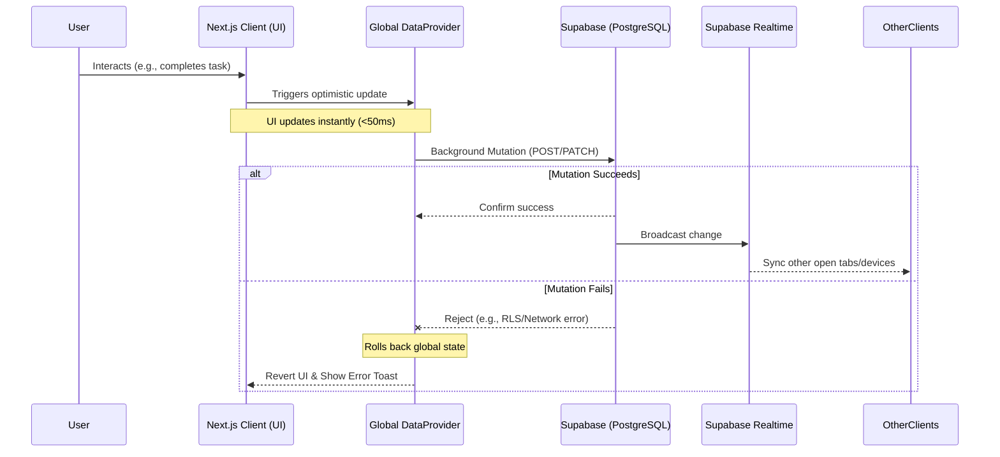

# Study Sprint: System Architecture

## 1. Overview
Study Sprint is a modern productivity web application built to help students manage their tasks and maintain focus. It combines traditional to-do list functionality with timeboxing (focus sprints), analytics, and gamified social features (Study Hall leaderboard) to encourage consistent study habits.

## 2. Technology Stack
- **Framework**: Next.js 15 (App Router)
- **Language**: TypeScript throughout the stack
- **Styling**: Tailwind CSS + Shadcn UI + Framer Motion for animations
- **Backend/Database**: Supabase (PostgreSQL)
- **Authentication**: Supabase Auth (SSR configured)
- **State Management**: React Context API (`DataProvider`, `FocusProvider`) + Optimistic UI updates
- **Real-time**: Supabase Realtime for instant synchronization of tasks across tabs and devices

## 3. Core Architecture Concepts

### 3.1 System Data Flow View



### 3.2 Data Flow & State Management
The application utilizes a global state provider pattern combined with optimistic UI updates to achieve extreme performance ("Load time < 2s").
- **`DataProvider`**: Fetches all essential user data (lists, todos, sessions) in parallel on initial load or auth state change. This prevents waterfall queries and serves as a single source of truth for the UI.
- **Optimistic UI**: When users interact with the app (e.g., checking off a task), the UI updates instantly while the database mutation runs in the background. If the mutation fails, the UI rolls back.
- **Memoization**: Heavy usage of `useMemo` and `useCallback` to prevent unnecessary re-renders (e.g., calculating completion progress and caching sidebar handlers).

### 3.3 Real-time Synchronization
The application leverages Supabase's Realtime subscriptions. When a list, task, or focus session is updated on another device or tab, the `DataProvider` listens for these PostgreSQL changes and automatically updates the global state, ensuring the UI remains perfectly synced without manual refreshes.

### 3.4 The "Study Hall" & Leaderboard
The Study Hall is a global leaderboard calculated dynamically using a PostgreSQL Database View (`weekly_leaderboard`). Instead of relying on backend cron jobs to reset weekly progress, the view safely queries the `focus_sessions` table with a `date_trunc('week', now())` filter, automatically summing up focus minutes for the current week in real-time.

## 4. Directory Structure

```text
src/
├── app/                  # Next.js App Router pages and layouts
│   ├── dashboard/        # Analytics, insights, and study heatmaps
│   ├── login/            # Authentication screens
│   ├── settings/         # User preferences
│   ├── study-hall/       # Global leaderboard and real-time activity feed
│   └── todos/            # Core task management & focus sprint UI
│       ├── todos-client.tsx    # Optimistic UI & task rendering
│       ├── focus-timer.tsx     # Session tracking components
│       └── list-sidebar.tsx    # Multi-list navigation
├── components/           # Reusable React components
│   ├── data-provider.tsx # Global state for user data (Lists, Todos, Sessions)
│   ├── focus-provider.tsx# Global state for active study sessions/timer
│   └── ui/               # Shadcn UI base components (buttons, dialogs, etc.)
└── lib/                  # Utilities and clients
    ├── supabase/         # Supabase clients (browser.ts & server.ts)
    └── types.ts          # Global TypeScript interfaces
```

## 5. Database Schema (Supabase)

- **`profiles`**: Stores user display information (`username`, `full_name`, `avatar_url`). Linked 1:1 with `auth.users`.
- **`todo_lists`**: Represents folders/subjects for organizing tasks.
- **`todos`**: Individual tasks, optionally linked to a specific `list_id`. Tracks `is_done`.
- **`focus_sessions`**: Records completed sprints (e.g., 'focus', 'shortBreak'). Contains `duration_seconds` for analytics and the global leaderboard.
- **`todo_images`**: Metadata for user-uploaded images attached to tasks, referencing the Supabase Storage bucket.
- **`weekly_leaderboard`**: A dynamic Postgres View joining `profiles` and `focus_sessions` to aggregate weekly focus times.

## 6. Security & Authorization (Row Level Security)

Study Sprint strictly enforces data segregation and privacy at the database layer using **PostgreSQL Row Level Security (RLS)**, ensuring that security cannot be bypassed by frontend alterations.

- **Authentication Gate**: Next.js middleware and Supabase SSR verify user session tokens (`sb-access-token`) on every protected route transition.
- **Tenant Isolation**: Every database table (`todos`, `todo_lists`, `focus_sessions`) requires a valid `user_id` mapping back to `auth.users()`.
- **Policy Examples**:
  - `SELECT`: Users can only read rows where `user_id = auth.uid()`, preventing unauthorized access to other students' tasks.
  - `INSERT/UPDATE`: Mutations instantly fail unless the payload's `user_id` matches the securely signed JWT token of the requesting user.
- **Study Hall Integrity**: The `weekly_leaderboard` view uses `security invoker` privileges but intentionally aggregates non-sensitive data (username and focus duration) across all users to enable social features without exposing private tasks.

## 7. Performance & UX Optimizations
- **Smart Querying**: The app queries only necessary columns to minimize payload sizes (Query Selectivity).
- **Skeleton Loaders**: Async operations are masked with smooth skeleton screens to maintain perceived performance.
- **Micro-interactions**: Enhanced UX via Framer Motion for list transitions, and `canvas-confetti` to celebrate completing focus sessions.
- **System-Aware Theming**: Full support for light and dark modes via `next-themes`.
